# Data flow & dependencies / Поток данных и зависимости

The diagram shows who builds whom (assembling) and the data flow from the entry
point down to the stores. All high-level entities are wired in the composition
root `src/di.py` (`create_app_services`).

Диаграмма показывает, кто кого создаёт (assembling) и поток данных от точки
входа до хранилищ. Все высокоуровневые сущности собираются в composition root
`src/di.py` (`create_app_services`).

> The remote-sync layer (`ConnectionManager`, `RemoteSyncService`, SSH/FTP) is
> part of the `issue/25` branch (SSH/FTP connections).
>
> Слой remote-синхронизации (`ConnectionManager`, `RemoteSyncService`, SSH/FTP)
> находится в ветке `issue/25` (SSH/FTP подключения).

```mermaid
flowchart TB
    subgraph entry["Entry point"]
        main["App (src/main.py)"]
        di["di.create_app_services (composition root)"]
    end

    subgraph ui["UI"]
        ee["EconomyEditor (src/ui/economy_editor.py)"]
        fd["FileDisplay (src/file_display.py)"]
        evd["EventDisplay (src/event_display.py)"]
        std["SettingsTableDisplay (src/settings_table_display.py)"]
        fmd["FormDisplay (src/form_display.py)"]
        uav["UnavailableDisplay (src/unavailable_display.py)"]
        dp["DetailPanel ✓ ui/detail_panel.py"]
        bp["BatchPanel ✓ ui/batch_panel.py"]
        cs["ChipSet ✓ ui/chip_set.py"]
        fm["FilterMenu ✓ ui/filter_menu.py (FilterSpec)"]
        fp["FunPresenter ✓ ui/fun_presenter.py"]
    end

    subgraph controllers["Controllers"]
        fs["FileSession (src/controllers/file_session.py, flet-free)"]
        tc["TableController"]
        sc["SearchController"]
        pag["PaginationController"]
        dirty["DirtyStateManager"]
        undo["UndoManager (src/models/undo_manager.py)"]
        cmd["commands.py (RandomizeCommand / SaveCommand)"]
    end

    subgraph repo["Repositories"]
        xmlr["XmlRepository"]
        evr["EventRepository"]
        cache["FileCache"]
        sxmlr["XmlSettingsRepository"]
        sjsonr["JsonSettingsRepository"]
    end

    subgraph services["Services"]
        cfg["ConfigService"]
        econ["EconomyService"]
        prj["ProjectService"]
        stg["SettingsService"]
        upd["UpdateService"]
        ent["EntertainmentService"]
        prof["ProfileService"]
        pload["ProfilePreloadService (src/services/profile_preload_service.py)"]
    end

    subgraph schema["Schema (code module)"]
        cent["src/custom_entities.py"]
        exp["src/expansion.py (Expansion Mod entities)"]
        fschema["src/form_schema.py (FormSchema tree + registry)"]
        modh["src/mod_handlers.py (NotYetAvailableMod registry)"]
    end

    subgraph models["Models"]
        row["RowData"]
        fdef["FieldDef"]
        proj["Project"]
    end

    subgraph remote["Remote sync"]
        cm["ConnectionManager"]
        cr["ConnectionRepository"]
        rss["RemoteSyncService"]
        conncfg["ConnectionConfig"]
        factory["connection_factory"]
        ssh["SSHConnection"]
        ftp["FTPConnection"]
    end

    main -->|"creates"| di
    di -->|"AppServices"| cfg
    di -->|"AppServices"| stg
    di -->|"AppServices"| upd
    di -->|"AppServices"| ent
    di -->|"AppServices"| prj
    di -->|"fixed FileCache"| cache
    di -->|"creates"| cm
    di -->|"creates"| rss
    di -->|"creates"| ee
    di -->|"creates"| prof
    di -->|"creates (shared cache)"| fd
    di -->|"creates (shared cache)"| evd
    di -->|"creates"| std
    di -->|"creates"| fmd
    di -->|"creates"| uav

    App._main -->|"swaps tabs"| ee
    ee -->|"load_project/unload"| fd
    ee -->|"load_project/unload"| evd
    ee -->|"load_project/custom entities"| std
    ee -->|"load_project/expansion areas"| std
    ee -->|"load_project/form entities"| fmd
    ee -->|"unavailable entities"| uav
    ee -->|"config_service"| cfg

    main -->|"preload dialog + progress"| pload
    main -->|"preload_cached"| std
    pload -->|"estimate/should_confirm"| std

    fd -->|"xml_repo (IXmlRepository)"| xmlr
    fd -->|"cache (ICache)"| cache
    fd -->|"detail_panel (IDetailPanel)"| dp
    fd -->|"batch_panel (IBatchPanel)"| bp
    fd -->|"entertainment"| ent
    fd -->|"fun_presenter (FunPresenter)"| fp
    fd -->|"filter_menus (FilterMenu[])"| fm
    fd -->|"session (FileSession)"| fs
    fd -->|"TableController"| tc

    fs -->|"state + ops (rows/undo/search/pagination/dirty)"| sc
    fs -->|"state + ops"| pag
    fs -->|"state + ops"| dirty
    fs -->|"state + ops"| undo
    fs -->|"SaveCommand / RandomizeCommand"| cmd
    fs -->|"xml_repo (IXmlRepository)"| xmlr
    fs -->|"cache (ICache)"| cache

    fp -->|"presentation + dialogs"| ent

    evd -->|"event_repo"| evr
    evd -->|"cache"| cache
    evd -->|"TableController"| tc
    evd -->|"UndoManager"| undo

    std -->|"XmlSettingsRepository"| sxmlr
    std -->|"JsonSettingsRepository"| sjsonr
    std -->|"TableController"| tc
    std -->|"get_renderer/get_columns"| cent
    std -->|"get_renderer/get_columns"| exp
    fmd -->|"JsonSettingsRepository.load_doc/save_doc"| sjsonr
    fmd -->|"get_form_schema_for_path/build_auto_form_schema"| fschema
    fmd -->|"schemas"| exp
    uav -->|"is_not_yet_available/get_mod_handler"| modh

    xmlr -->|"cache"| cache
    xmlr -->|"rows: RowData"| row
    evr -->|"cache"| cache
    evr -->|"rows: RowData"| row
    sxmlr -->|"RowData"| row
    sjsonr -->|"RowData"| row

    tc -->|"FieldDef/RowData"| models
    bp --> tc

    prj -->|"Project[]"| proj
    cfg -->|"ce: cfgeconomycore.xml"| xmlr
    econ -->|"types_dir/file list"| proj
    econ -->|"get_expansion_files"| exp
    prof -->|"scan_profiles(profiles_dir)"| proj
    ee -->|"profile_service (IProfileService)"| prof

    cm -->|"IRemoteConnection"| factory
    factory --> ssh
    factory --> ftp
    cm -->|"ConnectionConfig[]"| cr
    cm -->|"ConnectionConfig"| conncfg
    cr -->|"ConnectionConfig"| conncfg
    rss -->|"uses"| cm
    rss -->|"create()"| factory
```

