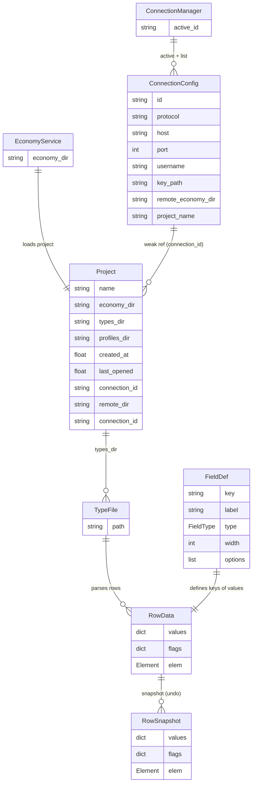

# Data models ER / ER-диаграмма моделей данных

Relations between dataclass models. The models are primarily data snapshots:
`RowData` is a table row (types/events), `RowSnapshot` is its undo snapshot.

Связи между dataclass-моделями. Модели — это прежде всего снимки данных:
`RowData` — строка таблицы (types/events), `RowSnapshot` — её снимок для undo.

> `ConnectionConfig` and the remote-project model belong to the remote-sync layer
> (`issue/25`: SSH/FTP connections).
>
> `ConnectionConfig` и проектная модель remote-проекта относятся к слою
> remote-синхронизации (`issue/25`: SSH/FTP подключения).

Notes / Пояснения:

- `RowData.values` keys correspond to the column names defined by
  `FieldDef.key` (`STATIC_FIELD_DEFS` in `src/models/field_def.py`).
- `UndoManager` stores `RowSnapshot`s (deep-copied values), not live `RowData`
  references.
- `Project.connection_id` is a weak string link to `ConnectionConfig.id` (used
  by remote projects). `Project.remote_dir` is the remote economy directory;
  `Project.is_remote` is true when `connection_id` is set.
- The `RowData ═ RowSnapshot` relation is implemented in
  `UndoManager.take_snapshot()`.

- `RowData.values` — ключи соответствуют именам колонок, заданным через
  `FieldDef.key` (`STATIC_FIELD_DEFS` в `src/models/field_def.py`).
- `UndoManager` хранит `RowSnapshot`-ы (deep-copy значений), не ссылки на
  живые `RowData`.
- `Project.connection_id` — слабая связь строкой на `ConnectionConfig.id`
  (используется remote-проектами). `Project.remote_dir` — удалённый каталог
  экономики; `Project.is_remote` истинно, когда задан `connection_id`.
- Связь `RowData ═ RowSnapshot` реализована в `UndoManager.take_snapshot()`.
