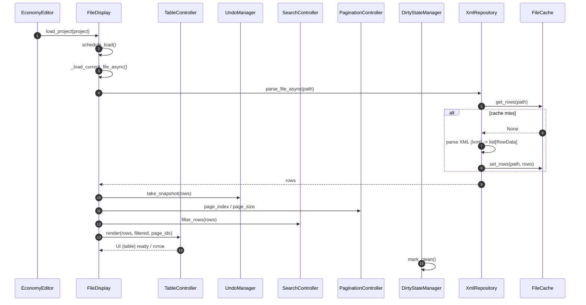

# Sequence: file load / Последовательность: загрузка файла

The flow of opening a types/events file. `FileDisplay` and `EventDisplay` kick
off background loading themselves through the shared cache and reusable
controllers.

Поток открытия types/events файла. `FileDisplay` и `EventDisplay` сами
запускают фоновую загрузку через общий кэш и переиспользуемые контроллеры.

Differences for events (`EventDisplay`): same flow, but `XmlRepository` is
replaced by `EventRepository` (parses `cfgeventspawns.xml` → `RowData`), and
`TableController`/`UndoManager` are reused.

Отличия для событий (`EventDisplay`): тот же поток, но `XmlRepository`
заменяется на `EventRepository` (парсинг `cfgeventspawns.xml` → `RowData`),
а `TableController`/`UndoManager` переиспользуются.