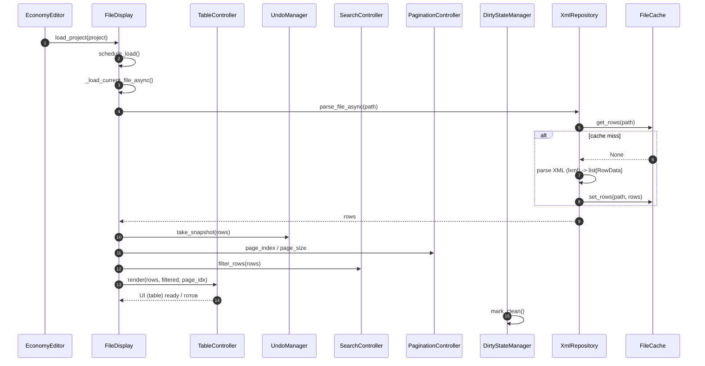
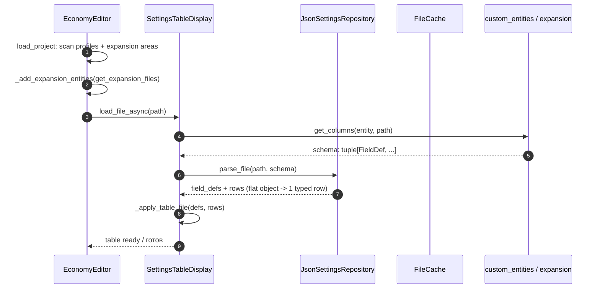
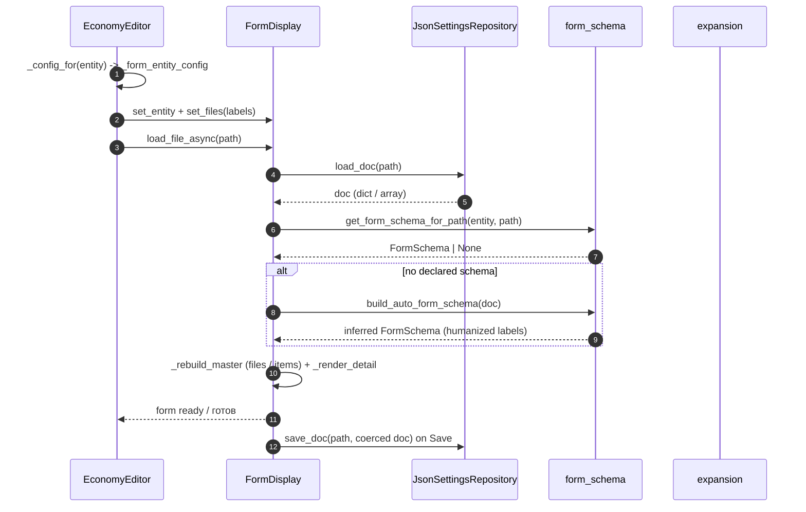

# Sequence: file load / Последовательность: загрузка файла

The flow of opening a types/events file. `FileDisplay` and `EventDisplay` kick
off background loading themselves through the shared cache and reusable
controllers.

Поток открытия types/events файла. `FileDisplay` и `EventDisplay` сами
запускают фоновую загрузку через общий кэш и переиспользуемые контроллеры.

Differences for events (`EventDisplay`): same flow, but `XmlRepository` is
replaced by `EventRepository` (parses `cfgeventspawns.xml` → `RowData`), and
`TableController`/`UndoManager` are reused.

Отличия для событий (`EventDisplay`): тот же поток, но `XmlRepository`
заменяется на `EventRepository` (парсинг `cfgeventspawns.xml` → `RowData`),
а `TableController`/`UndoManager` переиспользуются.

## Settings / custom-entity load / Загрузка настроек и кастомных сущностей

Custom entities (profiles, `custom_entities`, Expansion Mod mission files) load
through `SettingsTableDisplay`: the repo `parse_file(path, schema)` receives the
declared `FieldDef` columns (`get_columns(entity, path)`) so flat JSON objects
render as one typed row per file; undeclared keys are appended as extra TEXT
columns. `EconomyEditor.load_project()` merges mission-side Expansion files into
the `ExpansionMod` entity via `EconomyService.get_expansion_files(economy_dir)`.

Кастомные сущности (профили, `custom_entities`, миссионные файлы Expansion Mod)
загружаются через `SettingsTableDisplay`: репозиторий `parse_file(path, schema)`
получает объявленные колонки `FieldDef` (`get_columns(entity, path)`), поэтому
плоские JSON-объекты рендерятся как одна типизированная строка на файл;
необъявленные ключи добавляются как доп. TEXT-колонки. `EconomyEditor.load_project()`
вливает миссионные Expansion-файлы в сущность `ExpansionMod` через
`EconomyService.get_expansion_files(economy_dir)`.

## Form / master-detail load / Загрузка формы (master-detail)

Entities with declared form schemas (`src/expansion.py` traders/categories/quests
and any `register_form_schema`/`register_form_folder_schema`) route to
`FormDisplay` instead of the table: `EconomyEditor` uses
`entity_has_form_schemas(entity, files)` and wires
`form_display.on_file_select = switch_file` so the master list switches files.

Profile files are keyed by relative path (`ProfileService`), so the file master
list is an expandable tree: labels split on `/` become nested `ExpansionTile`
categories (`Loadouts/BanditLoadout.json` → `Loadouts` tile; subcategories like
`Quests/NPCs/` nest deeper), file rows show the basename, and the path of the
currently selected file is auto-expanded.
`FormGrid.item_schema` enables recursive grids: `InventoryAttachments` slots and
their `Items`/`InventoryCargo` render as nested tile forms instead of raw JSON.

Сущности с объявленными form-схемами (трейдеры/категории/квесты из
`src/expansion.py` и любые `register_form_schema`/`register_form_folder_schema`)
маршрутизируются в `FormDisplay` вместо таблицы: `EconomyEditor` использует
`entity_has_form_schemas(entity, files)` и подключает
`form_display.on_file_select = switch_file`, чтобы мастер-список переключал файлы.

Профильные файлы ключуются относительным путём (`ProfileService`),
поэтому мастер-список файлов группируется по категориям (первый сегмент пути,
например `Loadouts/BanditLoadout.json` → заголовок `Loadouts`; заголовки видны,
только когда категорий ≥ 2). `FormGrid.item_schema` включает рекурсивные гриды:
слоты `InventoryAttachments` и их `Items`/`InventoryCargo` рендерятся вложенными
tile-формами вместо сырого JSON.

