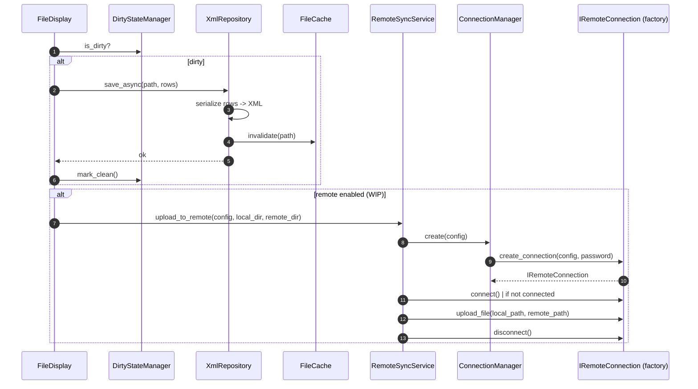

# Sequence: save + remote sync / Последовательность: сохранение + remote-синхронизация

Local saving goes through the repository and `FileCache`; optionally an upload
to the remote is triggered after saving (remote-sync layer — WIP).

Локальное сохранение идёт через репозиторий и `FileCache`; опционально после
сохранения запускается выгрузка в remote (слой remote-синхронизации — WIP).

> The `RemoteSyncService`/`ConnectionManager`/SSH/FTP part is not yet on `main`
> — shown as the target behavior (see `docs/diagrams/dependencies.md`).
>
> Часть с `RemoteSyncService`/`ConnectionManager`/SSH/FTP ещё не в
> `main` — показана как целевое поведение (см. `docs/diagrams/dependencies.md`).