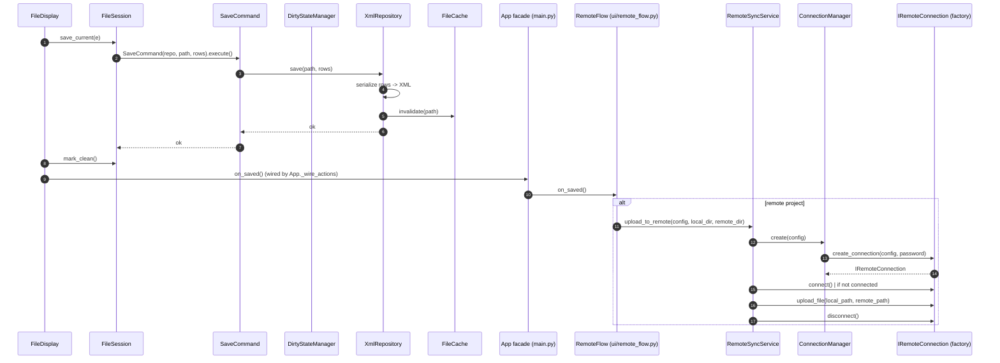

# Sequence: save + remote sync / Последовательность: сохранение + remote-синхронизация

Local saving goes through `FileSession`/`SaveCommand`, the repository and
`FileCache`; after a successful save the display fires its `on_saved` callback,
which the `App` facade wires to `RemoteFlow.on_local_saved` so remote projects
trigger an upload (remote-sync layer — `issue/25`).

Локальное сохранение идёт через `FileSession`/`SaveCommand`, репозиторий и
`FileCache`; после успешного сохранения `FileDisplay` (или `EventDisplay`)
дёргает callback `on_saved`, который фасад `App` привязывает к
`RemoteFlow.on_local_saved`, чтобы для remote-проектов запустить выгрузку
(слой remote-синхронизации — `issue/25`).

