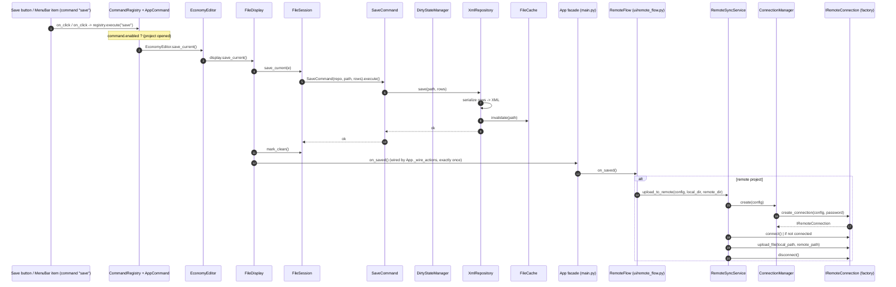

# Sequence: save + remote sync / Последовательность: сохранение + remote-синхронизация

All Save actions (top-level shell button, in-panel display buttons and the
MenuBar `File ▸ Save`, shortcut `Ctrl+S`) dispatch through the central
`CommandRegistry` (`save` command) to `EconomyEditor.save_current`, which
forwards to the active display. The display saves via `FileSession`/
`SaveCommand`, the repository and `FileCache`; after a successful save it fires
its `on_saved` callback exactly once, which the `App` facade wires to
`RemoteFlow.on_local_saved` so remote projects trigger a single upload
(remote-sync layer — `issue/25`). The old `App._on_save` — which called
`on_local_saved()` a second time — was removed.

Все кнопки Save (верхняя панель, кнопки в панели дисплея и меню
`File ▸ Save`, горячая клавиша `Ctrl+S`) диспетчеризуются через центральный
`CommandRegistry` (команда `save`) в `EconomyEditor.save_current`, который
проксирует вызов активному дисплею. Дисплей сохраняет через `FileSession`/
`SaveCommand`, репозиторий и `FileCache`; после успешного сохранения он
ровно один раз дёргает callback `on_saved`, который фасад `App` привязывает к
`RemoteFlow.on_local_saved`, чтобы для remote-проектов запустить единственную
выгрузку (слой remote-синхронизации — `issue/25`). Старый `App._on_save`,
вызывавший `on_local_saved()` второй раз, удалён.

